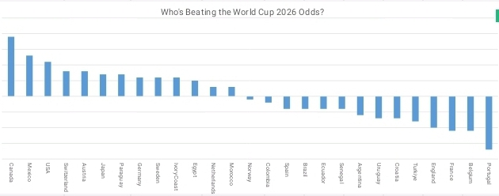

# World Cup 2026: Odds vs Reality

## The Question
Before the tournament started, bookmakers and betting markets ranked teams by their expected chances of winning. Did the market get it right? This project tracks which teams are outperforming or underperforming their pre-tournament odds based on actual group-stage results.

## Approach
1. **Collect pre-tournament odds** for ~20-30 teams (outright winner odds from sportsbooks, converted to implied probability)
2. **Collect actual group-stage results** (wins, draws, losses, goal difference, points) as the tournament progresses
3. **Use SQL** to join the two datasets and rank teams by the gap between expected performance (odds rank) and actual performance (points/goal difference rank)
4. **Summarize in Excel** with a clean table and chart highlighting the biggest overperformers and underperformers

## Tools
- SQL (data joining, ranking, filtering)
- Excel (summary table + chart)

## Structure
- `/sql` — queries used to build the odds-vs-results comparison
- `/excel` — summary workbook with pivot table and chart
- `data/` — raw odds and results data used in this analysis

## Status
complete-group stage analysis finished"
## Key Finding

After comparing pre-tournament betting odds against actual World Cup 2026 group-stage results, the data shows several teams significantly outperforming or underperforming what the market expected:

**Biggest overperformer:** Canada had the largest positive rank_gap in the dataset — despite being a heavy underdog pre-tournament (one of the lowest-rated teams by odds), Canada's group-stage results placed them far higher in the actual standings than bookmakers predicted.

**Biggest underperformer:** Portugal showed the largest negative rank_gap — entering as one of the more fancied teams by pre-tournament odds, their group-stage results so far have fallen well short of that expectation.

**Overall pattern:** Several mid-tier underdogs (Mexico, USA, Switzerland, Austria) outperformed their odds, while a few traditional favorites (Portugal, Belgium, France, England) underperformed relative to where the market ranked them. This suggests pre-tournament odds — while a reasonable predictor for the very top favorites (Spain, Argentina stayed close to their expected rank) — can be a weaker signal for mid-table and lower-rated teams once real matches are played.

